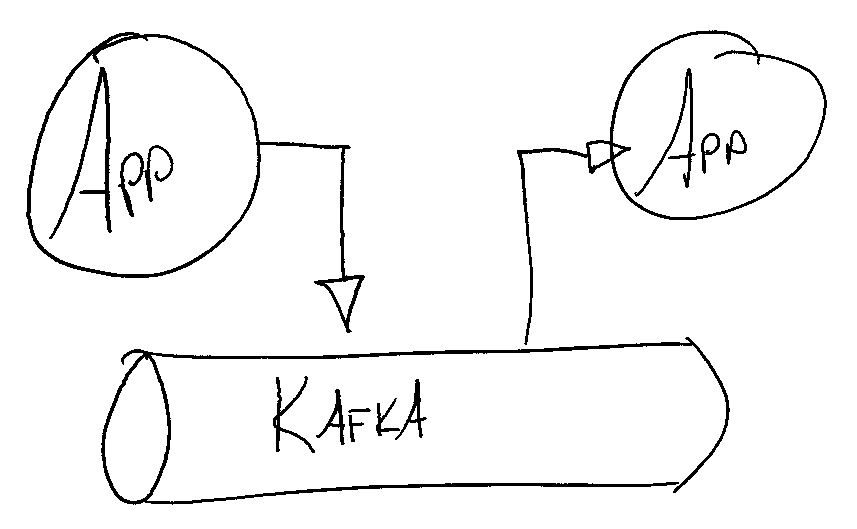
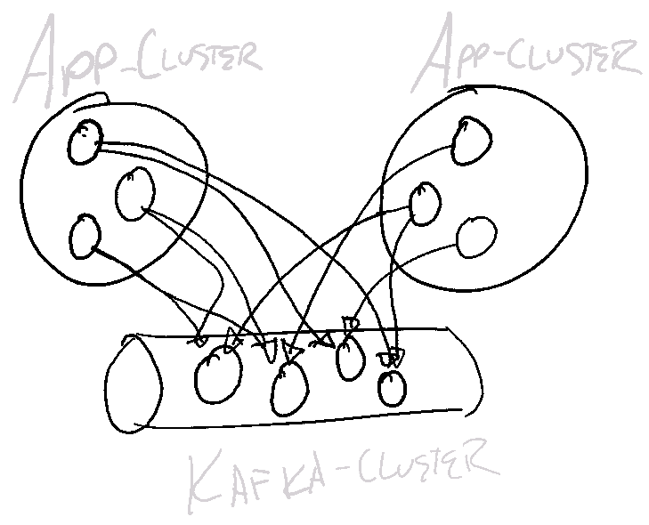
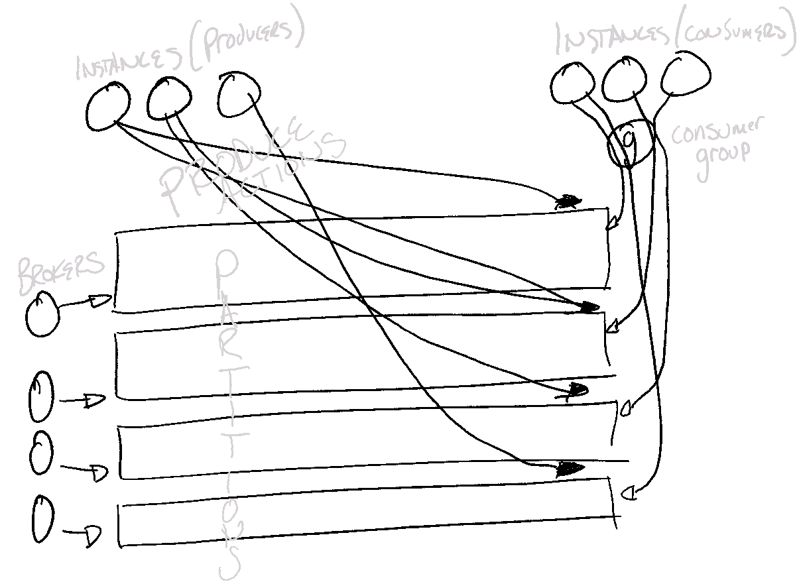

# Vision
A stand-alone, in-browser, tool for exploring how resource constraints cause unexpected bottlenecks, using Kafka as the example.

Also, a tool for rasing understanding of how Kafka generally works.

## Why do this at all?
I'm an sysadm/integrator/devops/sre/??? engineering generalist, so my Javascript code may not be all that beautiful. 
So why write a simulator like this at all?

This is part of a "10-percent" learning project, that also wants to fuel other "10-percent" learning projects. 
We hope to learn about other areas to strengthen our core area.

By simulating Kafka, we can learn a great deal about three things:
1. Javascript + React (Things our application developers use all day long)
1. Kafka
1. Why adminstrators "over-ask" on infrastructure requirements
   - And unintended, unexpected consequences of this

## How does Kafka work?

At a high level, most people might say something like "Applications write to a **Kafka Topic**, then other applications read from that **Kafka Topic**."
This first-level understanding is sufficient, but if you're looking at a github repository concerning simulation you want to know more.

Going one layer deeper, you might be tempted to introspect the TCP sessions.
You would see connections to _some, but not all_ **Kafka Brokers** in the cluster by each of the producer/consumer applications.

Going one layer deeper, but in a different direction, you would inspect the state and data structures of Kafka itself.  
You would discover append-only logs (called **Kafka Partitions**), and the concept of a **Consumer Group**.  
You might find that producers are **Keying messages** to ensure they arrive on particular partitions.

And you may even go so far as to track how **Partition Replicas** are distributed to have your data survive a broker failure. (Not even pictured here!)

Finally, you'd probably want to see these things vary with respect to time.  
If that is your desire, you're (hopefully) in the right place to help us out and/or use the tool!

## How do bottlenecks move in Distributed Systems?
Quickly, and with great caprice.

_(TODO: Write a less pithy answer here.)_